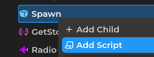

# How to insert scripts

## via Explorer

1. Right click on object you wanted to add script as a child
2. Select "Add Script"
3. Give your script a name, additionally you can specify which path to create your script in.
4. Press "Create" and there you are!

## via File Browser

1. Right click on folder > New > Script
2. Give your script a name, same as explorer
3. Press "Create" and there you are!

The new script can be found inside file browser. You can also drag script from file browser over to explorer to add them.